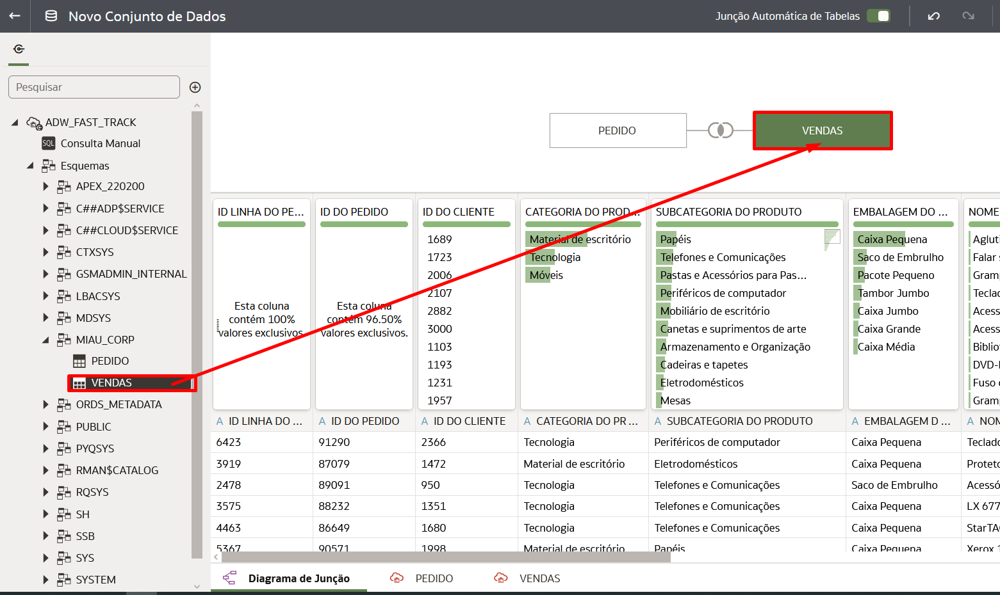
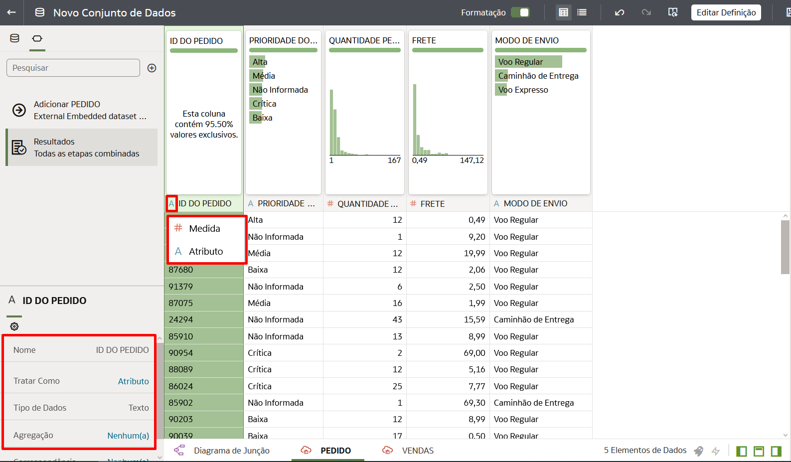
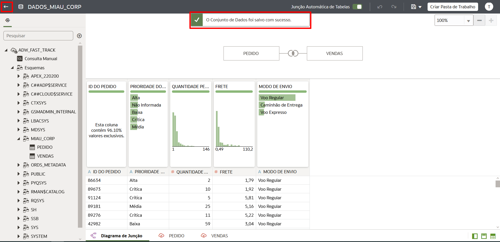
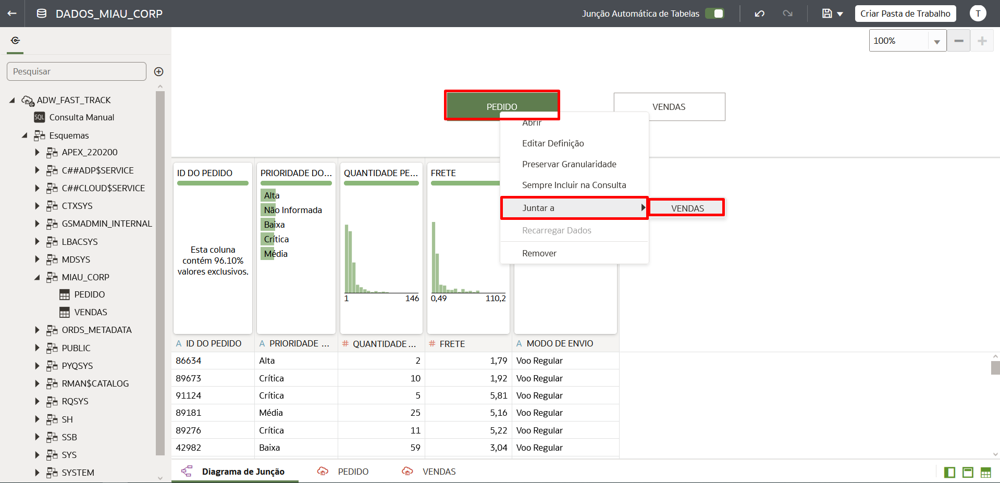
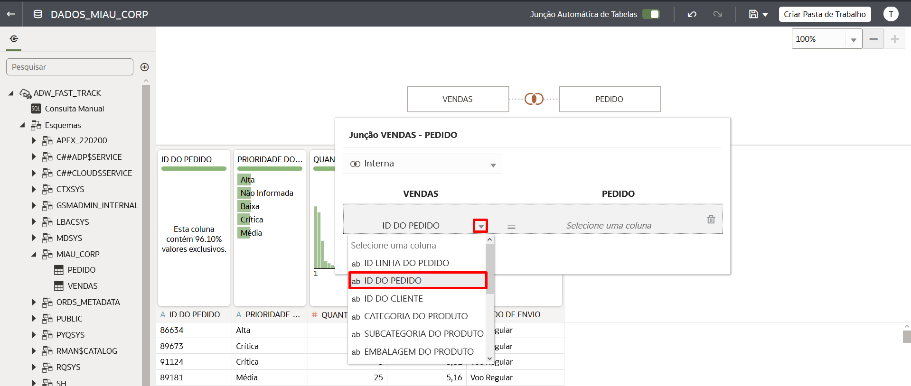
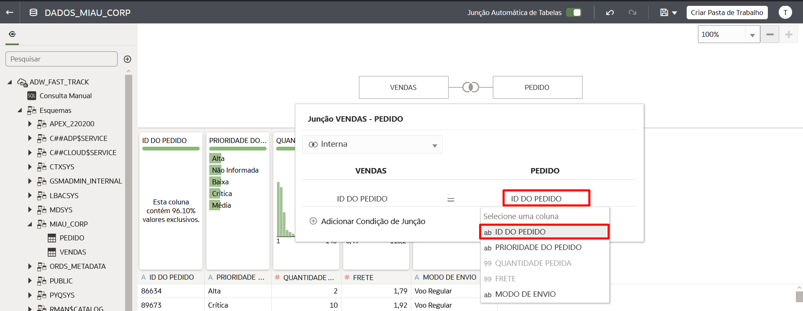

# Criar um Conjunto de Dados

## Introdução

Neste Lab você vai aprender a criar um Conjunto de Dados (Dataset) no Oracle Analytics Cloud

*Tempo estimado para o Lab:* 15 Minutos

### Objetivos

* Selecionar as tabelas
* Fazer o Join entre as tabelas
* Salvar o Conjunto de Dados

## Task 1: Localize as tabelas

1.	Clique no botão **Criar** na parte superior direita e em seguida selecione **Conjunto de Dados**.

2.	Selecione a conexão com o Autonomous Data Warehouse: **ADW\_FAST\_TRACK**.

3. Expanda a lista de Esquemas do Autonomous Data Warehouse (ADW), localize o Esquema MIAU_CORP e localize as duas tabelas que utilizaremos nesse Workshop: **Vendas** e **Pedidos**.

## Task 2: Join entre as tabelas

1.	Seleciona a tabela **Pedidos** e arraste até o centro da tela do Diagramas de Junção (Join).

2. Em seguida arraste a tabela **Vendas** e solte ao lado da tabela de pedidos.

O Oracle Analytics Cloud (OAC) vai criar o Join de forma automática para você, desde as duas tabelas tenham o mesmo nome na coluna e que as duas colunas sejam do mesmo **"Tipo"**.

> **Note:** Existem dois tipos de colunas no Oracle Analytics Cloud: Atributo ou Medida

As colunas do tipo ***Medida*** aceitam valores numéricos e poderemos executar operações matemáticas e agregações com os dados dessa coluna.

**Exemplo: Valor da Venda, Quantidade de produtos, Lucro, Custo, Desconto etc**

As colunas do tipo ***Atributo*** aceitam qualquer tipo de dados descritivo, que não serão usados para nenhum tipo de cálculo. Podemos ter campos com texto, números, localizações, datas, entre outros.

**Exemplo: ID de produto, ID do cliente, Número da Nota Fiscal, Nome do Cliente, Idade, Endereço, Data de Venda, Cidade, País etc**

## Task 3: Salvar o Conjunto de Dados

1. Verifique se você está na aba do Diagrama de Junção e clique no botão de salvar no topo direito da tela (ícone de um disquete).

2. Dê um nome e uma descrição para o Conjunto de dados:

*Nome:* DADOS\_MIAU\_CORP  
*Descrição:* Conjunto de Dados para Análise de Dados de vendas da MIAU CORP

3. Verifique se você recebeu a mensagem **O Conjunto de Dados foi salvo com sucesso** e em seguida clique em voltar.

4. Você verá seu novo Conjunto de Dados listado como indicado na imagem abaixo.

Você pode **seguir para o próximo Lab**.

## Task 4: Criar Join Manualmente (Opcional)

O Oracle Analytics Cloud (OAC) permite a criação de conjuntos de dados usando diversas tabelas e ainda oferece uma área especial chamada "Diagrama de Junção" para criarmos os Joins dessas tabelas. Geralmente o OAC cria o Join de forma automática entre as tabelas, mas em cenários onde ele não identifica colunas para esse Join nós podemos fazê-lo de forma manual.

Imagine que o Oracle Analytics Cloud não criou o Join entre a tabela "Pedidos" e a tabela "Vendas", o procedimento para criar o Join manualmente seria esse:

1. Clique com o botão direito em cima de uma das duas tabelas que estão no tela do "Diagrama de Junção", selecione a opção "Juntar a" e selecione a tabela que você deseja unir através do Join. Aqui no nosso exemplo será a tabela "Vendas".

2. Selecione a coluna que você vai usar para o Join na primeira tabela, no caso usaremos a coluna "ID DO PEDIDO".

3. Agora na segunda tabela selecione a coluna correspondente, no nosso caso as colunas possuem o mesmo nome "ID DO PEDIDO". *(Não é necessário que as duas colunas tenham o mesmo nome)*

## Conclusão

Nesta sessão você aprendeu criar um Conjunto de Dados no Oracle Analytics Cloud usando mais de uma tabela e aprendeu a utilizar o "Diagrama de Junção".

## Autoria

- **Autores** - Thais Henrique, Isabella Alvarez, Breno Comin, Isabelle Dias, Guilherme Galhardo
- **Último Update Por/Date** - Thais Henrique, Nov/2022