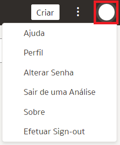
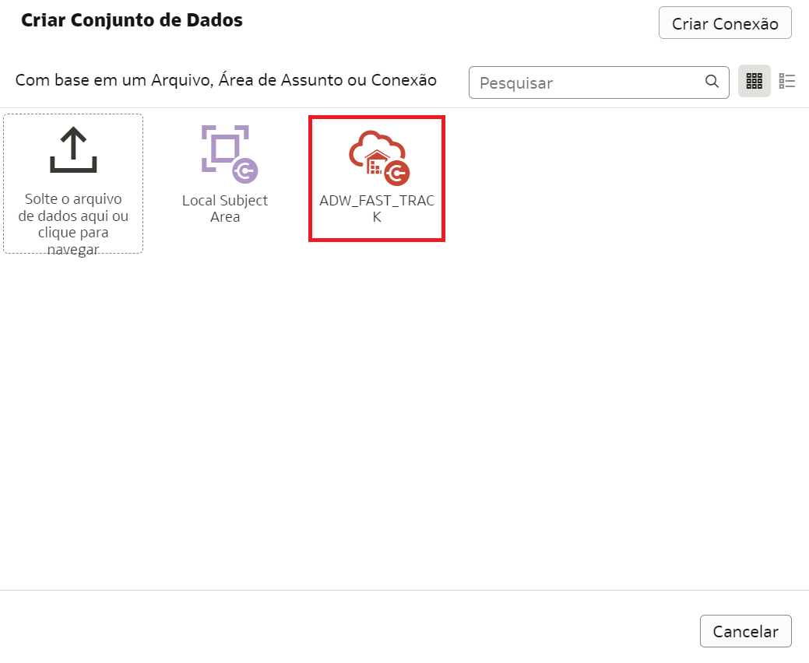
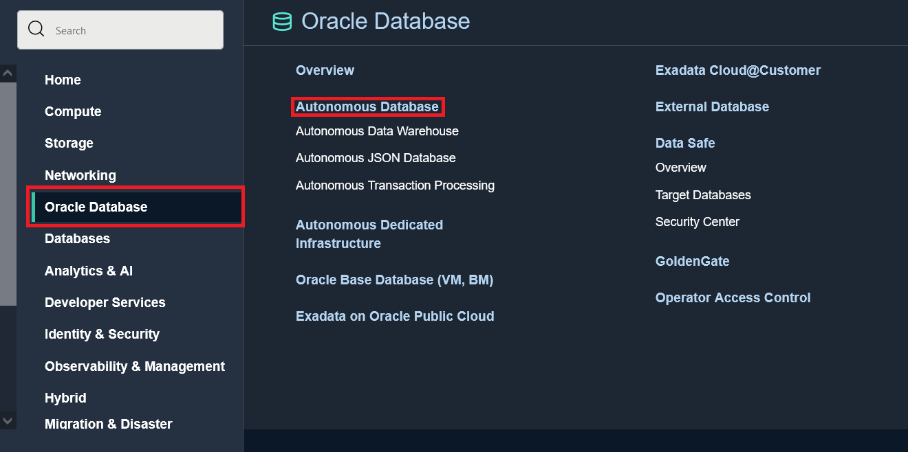
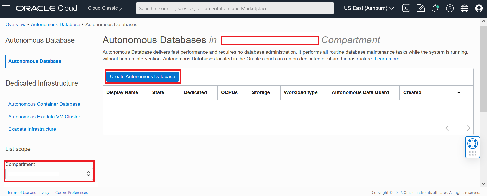
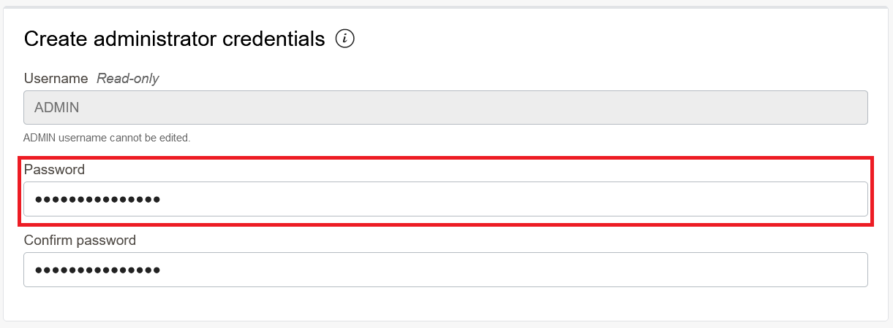

# Primeiros passos no OAC

## Introdução

Neste Lab você vai aprender a navegar pela interface do Oracle Analytics Cloud e, conectar o OAC a dados. 

***Overview***

O Oracle Analytics Cloud é um serviço de nuvem pública escalável e seguro que fornece um conjunto completo de recursos para explorar e executar análises colaborativas para você, seu grupo de trabalho e sua empresa. Com o Oracle Analytics Cloud, você também tem recursos flexíveis de gerenciamento de serviços, incluindo configuração rápida, dimensionamento e patches fáceis.
Como usuário do Oracle Analytics com acesso de Autor de Conteúdo do DV, você poderá estabelecer conexão com as origens de dados usadas por sua organização. Por exemplo, você pode criar um conjunto de dados que inclua tabelas de uma conexão do Autonomous Data Warehouse , tabelas de uma conexão Spark e tabelas de uma área de assunto local.

*Tempo estimado para o Lab:* 25 Minutos

### Objetivos

Neste Laboratório você vai:
* Explorar os recursos disponíveis de forma nativa dentro do OAC (Oracle Analytics Cloud)
* Testar sua conexão. 
* Estabelecer uma conexão com o Autonomous Data Warehouse (OPCIONAL)

## Task 1: Página Inicial

Assim que logar com seu ID de Usuário e Senha, você será direcionado para a página inicial da ferramenta. 
Quando você acessar pela primeira vez, o Oracle Analytics Cloud exibe um tour pelo produto. 
Esta tela inicial é a **Home page**.
  

Sempre que quiser retornar à ela:

1.	Clique no Menu Hamburguer no lado superior esquerdo da tela principal, 

   

Assim que a barra lateral se expandir, você verá o ícone correspondente a **Home**, selecione-o.

 

2.	Para explorar os projetos acessíveis, clique no Menu Hamburguer e escolha **Catálogo**. Você será direcionado para a seguinte tela:

  

3.	Seguindo o mesmo passo de clicar no **Menu Hamburguer**, ao clicar em **Dados**, será exibidos em **Conjunto de Dados**, dados disponíveis para serem usados, quando você upar uma tabela, planilha ou arquivo, eles ficarão salvos para serem consumidos imediatamente ou reaproveitados em outras ocasiões.

Ainda nesta aba, você poderá verificar **Conexões**:

À direita de **Conexões**, você pode acessar **Fluxos de Dados** clicando em cima dele.
Os fluxos de dados permitem que você organize e integre seus dados para produzir conjuntos de dados que seus usuários podem visualizar.

Por exemplo, você pode usar um fluxo de dados para:

* Criar um conjunto de dados.
* Combinar dados de diferentes fontes.
* Treinar modelos de aprendizado de máquina ou aplicar um modelo de aprendizado de máquina aos seus dados.

Seguindo, teremos **Sequências**. 
Uma sequência é definida como uma coleção de fluxos de dados que você executa juntos. Eles são úteis quando você quiser executar vários fluxos de dados como uma única transação. 

Por fim, **Replicações de Dados**. 
Use-o para copiar dados de uma origem para análise no Oracle Analytics Cloud. 

4.	O Oracle Analytics permite que você registre e use modelos de machine leaning Oracle do Oracle Database ou Oracle Autonomous Data Warehouse, volte mais uma vez no Menu Hamburguer e clique em **Aprendizagem Por Máquina** para acessar uma lista de modelos e scripts registrados:

5.	Abaixo de Aprendizagem Por Máquina, clique em **Modelos Semânticos** para acessar uma lista de modelos e scripts registrados:

O modelo de dados semânticos é uma abordagem que se baseia em princípios semânticos que resultam em um conjunto de dados com estruturas de dados especificadas inerentemente. 

6.	Para rastrear o status de seus jobs e gerenciá-los, continue navegando no Menu Hamburguer e clique em **Jobs**. Você pode monitorar o número de jobs filtrando por **Tipo de Objeto** e o **Status** do mesmo.

7.	Ao clicar em **Console** você encontrará opções para gerenciar permissões de usuário, configurar vários aspectos do Oracle Analytics Cloud e executar outras tarefas administrativas.

## Task 2: Opções de ID

1. Para ter acesso ao Help Center, editar seu perfil, mudar a senha ou efetuar, verificar a versão atual do OAC ou fazer logout da sua conta, basta clicar em cima do círculo com as iniciais da sua credencial.

## Task 3: Barra de Pesquisa

1. Através da **Barra de pesquisa** em sua Home Page, você pode pesquisar todos os tópicos apresentados aqui e todas as funcionalidades que existem dentro do OAC, desde as opções dentro do **Menu Hamburguer** até funções do **Criar**.

## Task 4: Teste Sua Conexão 

Para ter certeza que sua conexão está ativa e funcionando, visualize-a através da lista de conexões.
Tal lista contém as conexões que você criou e as conexões que você tem permissão para acessar e usar para criar conjuntos de dados.
Existem algumas formas de fazer essa verificação:

1.	No Menu Hamburguer da página inicial, clique em **Dados** e, em seguida, na guia **Conexões** para acessar a lista. Se a conexão foi feita de maneira correta, você será capaz de visualizá-la, bem como os detalhes da mesma.

2. Ao clicar em **Criar** e posteriormente em **Conjunto de Dados** para dar início à criação do seu conjunto, você será direcionado para uma guia onde imediatamente, conseguirá visualizar sua conexão. 

## Task 5: Criar uma Conexão (OPCIONAL)

Você pode se conectar a vários tipos de fonte de dados, como bancos de dados em nuvem (públicas e privadas), bancos de dados locais (incluindo JDBC - Conectividade de Banco de Dados Java) e muitos aplicativos comumente usados, como Dropbox, Google Drive e Amazon Hive.

Como administrador, você cria uma conexão com o Oracle Autonomous Data Warehouse que permite que outros usuários acessem fontes de dados e criem conjuntos de dados para seus projetos do Oracle Analytics. 

1.  Abra seu navegador da Web e acesse https://cloud.oracle.com . 

2.  Na página de login de **Cloud Infrastructure**, insira suas credenciais de login e, em seguida, clique em **Sign In**.

3.  Clique no ícone de menu no canto superior esquerdo para exibir o menu de navegação.

 

4.  Clique em **Oracle Database** logo em seguida, clique em **Autonomous Database**. 

  

5. Escolha o seu Compartimento no canto inferior esquerdo. O mesmo irá aparecer na parte superior da tela. Posteriormente, clique em **Create  Autonomous Database**.

 

6. Insira um nome de exibição em **Display name** e especifique o nome do banco de dados em **Database name**.

 

7. Escolha um tipo de carga de trabalho e um tipo de implantação.

 

8. Selecione a versão do banco de dados. 

A versão do banco de dados disponível é 19c. Em **OCPU count** especifique o número de núcleos de CPU. 

Abaixo, você encontrará **Storage (TB)**, neste caso, especifique o armazenamento que deseja fazer disponível para seu banco de dados, em terabytes. 

Por padrão, o dimensionamento automático de OCPU (**OCPU auto scaling**) é ativado para permitir que o sistema use automaticamente até três vezes mais recursos de CPU para atender à demanda de carga de trabalho. Se você não quiser usá-lo, desmarque essa opção.

 

9. Crie credenciais de administrador. 

Defina a senha para o usuário Autonomous Database Admin. Em seguida, digite a mesma senha novamente no campo abaixo para confirmar sua nova senha. 

    

10. Escolha o acesso à rede.

 

11. Escolha a licença, jutntamente com o Oracle Database Edition. Para finalizar a criação, no campo **Contact Email**, insira um endereço de e-mail válido. Para inserir vários endereços de e-mail de contato, repita o processo para adicionar até 10 e-mails de contato do cliente e então, **Create Autonmous Database**.

 

12. Seu banco aparecerá na página de bancos de dados autônomos, finalizando o provisionamento, com seu Automous Databse disponível, clique nos três pontinhos ao final da linha, selecione **Start**. Agora,selecione-o no link localizado em **Display Name**. Você será direcionado para outra página na qual deverá clicar em **DB Connection**.

 

13. A guia **Database Connection** se abrirá, em **Download client credentials (Wallet)**, clique em **Download Wallet**.

 

 14. Para criar uma conexão com o Oracle Autonomous Data Warehouse dentro do OAC, você deve entrar no Oracle Analytics. Na página inicial, no canto superior esquerdo, clique em **Criar** e, em seguida, clique em **Conexão**.

15. Será exibido uma nova janela, na qual mostrará os ícones dos conectores disponíveis.

Você pode pesquisar pelo nome ou rolar a barra para encontrar mais opções. Bastar clicar no ícone correspondente à conexão desejada para começar a configurá-la. 
Clique em **Oracle Autonomous Data Warehouse Cloud**.

16. Preencha todos os campos indicados.

Insira um **Nome da Conexão**, por exemplo, Corp_Connection.

Em **Descrição**, insira uma breve descrição.

Em seguida, clique em **Selecionar** ao lado de **Credenciais do cliente**. Faça o upload do arquivo zip da carteira, perceba que o campo será preenchido com **cwallet.sso**. 

Seguindo, digite seu nome de usuário e senha.

Finalmente, na lista **Nome do Serviço** selecione o serviço para seus dados, recomendamos **adwdb_medium** e clique em **Salvar**. 

Você cria uma conexão para cada fonte de dados que deseja acessar no Oracle Analytics. Uma vez conectado, você pode visualizar seus dados para criar insights.

Pronto!

Você pode **seguir para o próximo Lab**.

## Conclusão

Nesta sessão você aprendeu a explorar os principais recursos e definições do sistema  para localizar pastas de trabalho, dados e conexões, jobs e principais abas para configurar o sistema.
Além disso, você aprendeu quais fontes de dados você pode usar em conjuntos de dados, como acessá-los e averiguar se a conexão está apta a ser usada.

## Autoria

- **Autores** - Isabelle Dias
- **Último Update Por/Data** - Isabelle Dias, Novembro/2022