# Preparar um Conjunto de dados

## Introdução

Após a conexão com o banco e seleção das tabelas, neste lab você vai aprender a preparar seu Conjunto de Dados (Dataset) no Oracle Analytics Cloud, trazendo dados externos, enriquecendo a análise e realizando transformações preliminares à criação dos gráficos e visualizações

*Tempo estimado para o Lab:* 45 Minutos

### Objetivos
* Complementar os dados com arquivos externos
* Configurar localizações geográficas nos dados
* Ajustar colunas para nossas análises
* Criar novos campos a partir de cálculos

## Task 1: Trazer um arquivo .xlsx externo

1. Faça o download do arquivo excel necessário para esse laboratório através [deste link](https://objectstorage.us-ashburn-1.oraclecloud.com/n/id3kyspkytmr/b/ArquivosPublicos/o/Tabela%20Clientes%20-%20v2.xlsx)

2. Abra o seu projeto, clique no **botão '+'** (que está localizado no lado direito da tela, próximo às fontes de dados), e selecione **Adicionar Dados...**

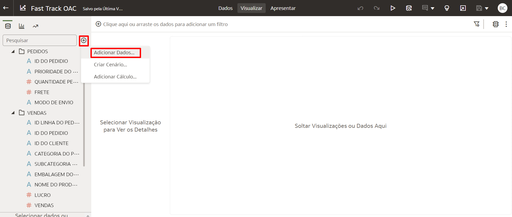

3. Clique em **Criar Conjunto de Dados**

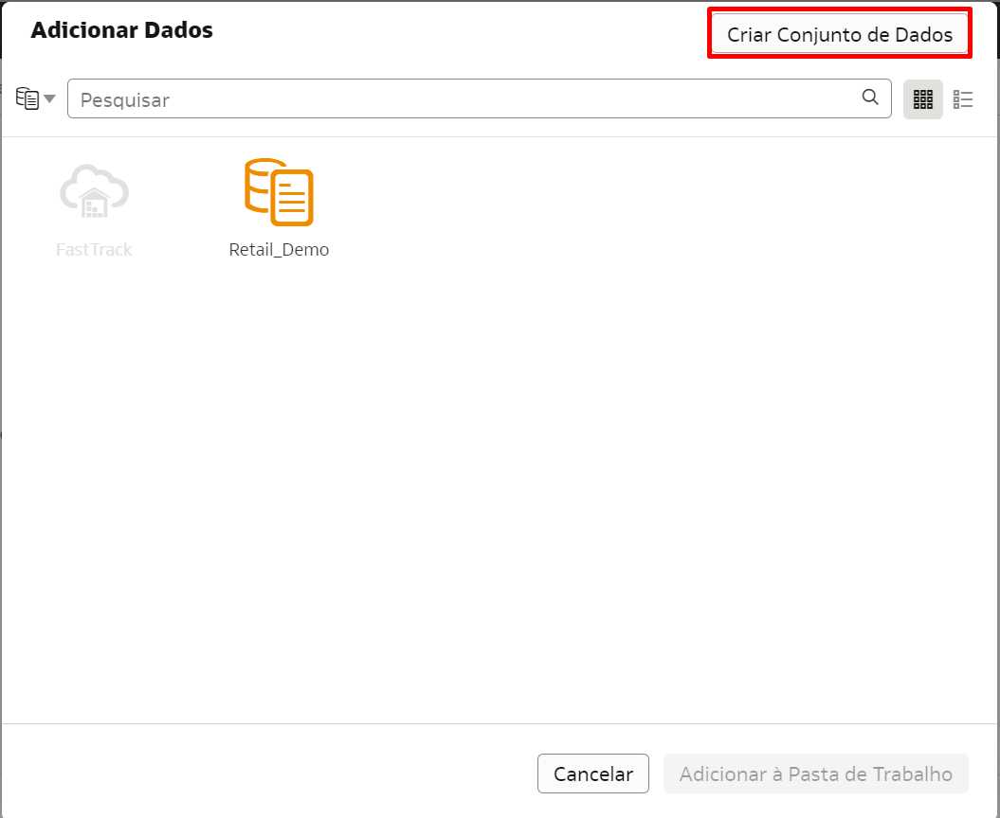

4. Arraste o arquivo **Tabela Clientes - v2.xlsx** para a janela que foi aberta ou clique no ícone indicado e indique a localização do arquivo no seu computador.


5. O Analytics carregará e processará seu arquivo, trazendo um preview de quais as colunas presentes nele. Neste passo não é necessário realizar alterações. Clique em **OK**.


6. **Dê um nome** para seu novo conjunto de dados e **salve-o** através do ícone do disquete.
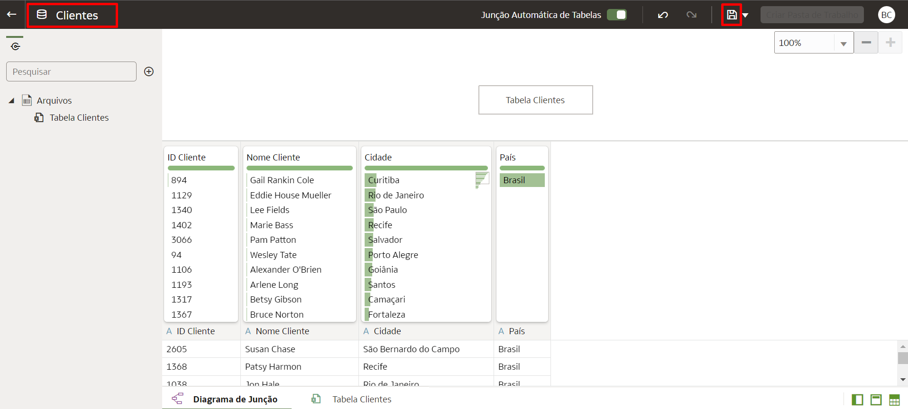
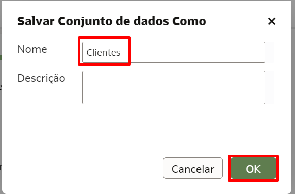

7. Note que durante o processo uma nova aba foi aberta no seu navegador. Garanta que o novo conjunto do dados está salvo e **feche essa aba**. Volte para a aba anterior e você verá que o conjunto de dados recém-criado já está em evidência. Selecione-o e clique em **Adicionar à Pasta de Trabalho**

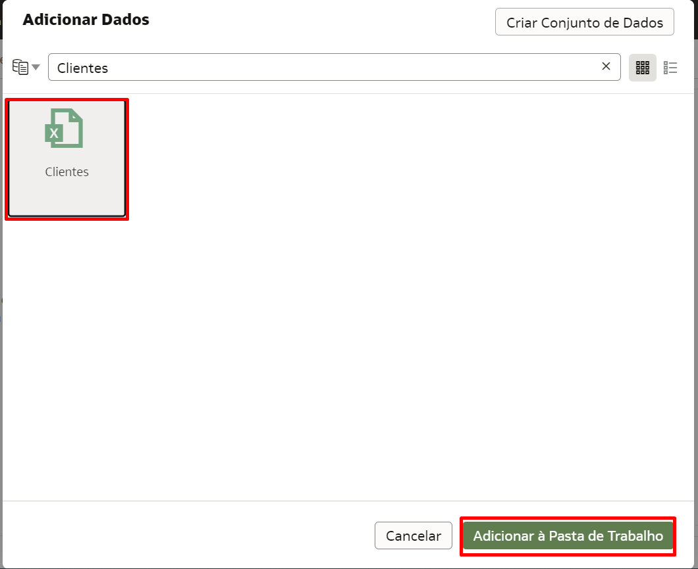

8. Agora já temos os dados do excel disponíveis em nosso projeto, mas a barra horizontal entre os conjuntos de dados indica que não há nenhuma junção entre os dados do banco e os do excel, o que nos impede de cruzá-los. Para resolver isso, navegue até a aba **Dados**.

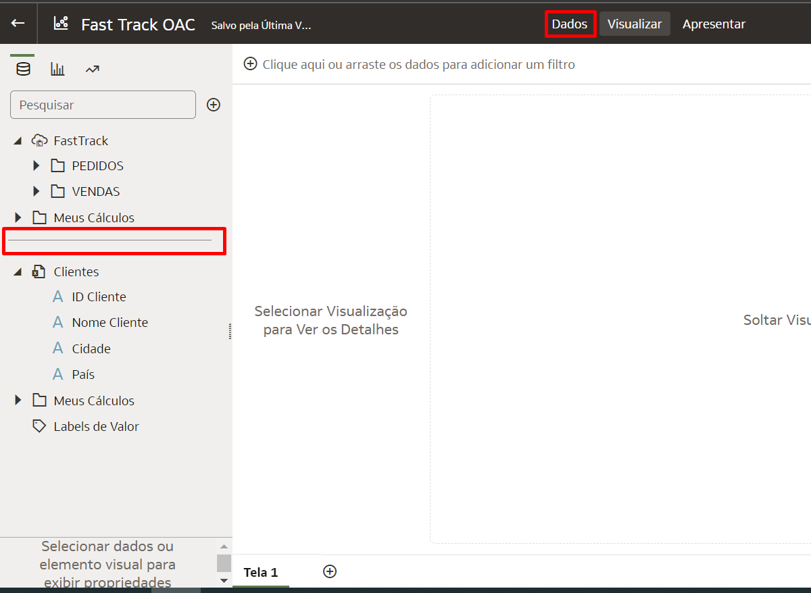

9. Leve o seu mouse até a região entre as duas fontes de dados e você verá uma linha tracejada conectando os dois, com o valor 0. **Clique nessa conexão**.

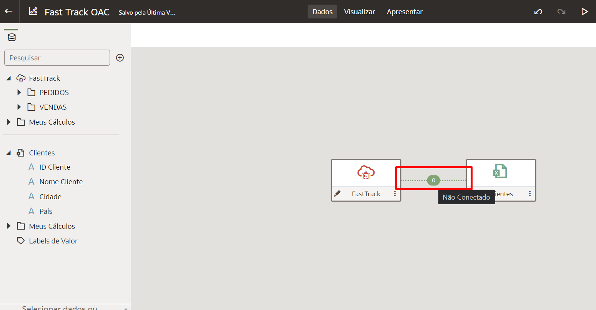

10. Selecione **Adicionar Outra Correspondência**.

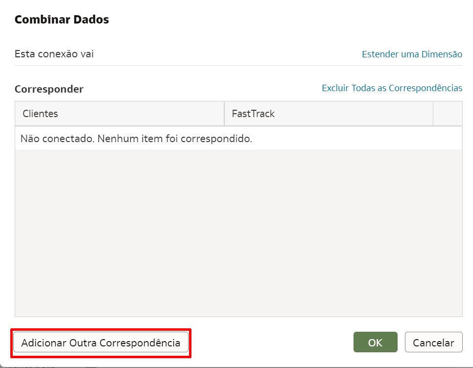

11. Relacione os dois arquivos através da chave comum entre eles (ID Cliente & ID DO CLIENTE). Após fazê-lo, clique no botão **OK**.


12. Você deverá ver que agora o numeral 1 surgiu entre as bases. Isso indica que elas estão unidas através de um Join que leva em consideração uma coluna em cada base.


13. Volte para a aba **Visualizar** e valide se a barra horizontal entre os conjuntos de dados desapareceu. Se isso aconteceu, essa tarefa está pronta. Não se esqueça de salvar o seu projeto para não perder o seu progresso.

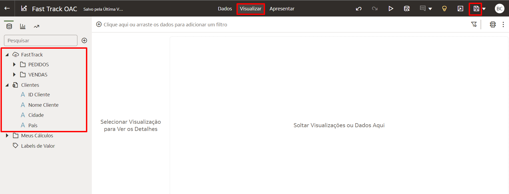

## Task 2: Configurar as Localizações no Conjunto de Dados

Em nossa segunda tarefa realizaremos a configuração das colunas que referenciam localizações geográficas para que tragam informações mais detalhadas e possam ser utilizadas na construção dos nossos mapas posteriormente.

1. Navegue até a aba **Dados** e selecione o botão para **Editar** o arquivo **Clientes**, que acabamos de carregar.


2. Todas as colunas estão corretamente identificadas como Atributos, portanto não será necessária qualquer alteração nesse aspecto. Selecione e coluna **Cidade** e note que do lado direito há uma série de sugestões de melhorias para ela. Clique na opção **Enriquecer Cidade com Province**.

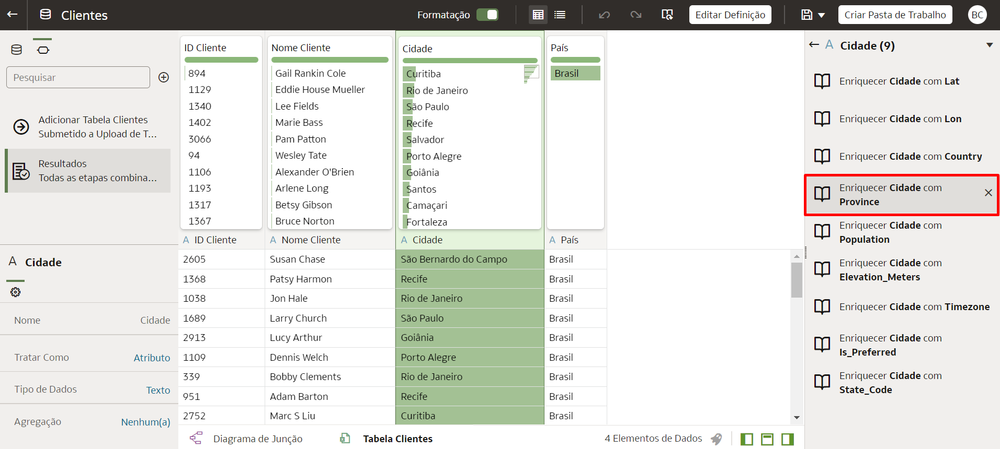

3. O Analytics irá se utilizar de suas bibliotecas internas para trazer o estado de cada uma das cidades indicadas, criando uma nova coluna chamada Cidade_Province.

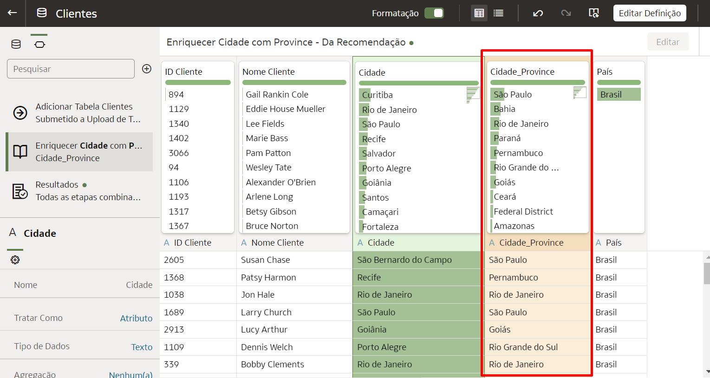

4. Na coluna Cidade_Province clique nos três pontos e selecione a opção **Renomear...**


5. Dê o nome **Estado** para essa coluna e salve essa alteração. Também é possível renomear uma coluna realizando um **duplo-clique** no nome dela e escrevendo o novo nome desejado para ela.

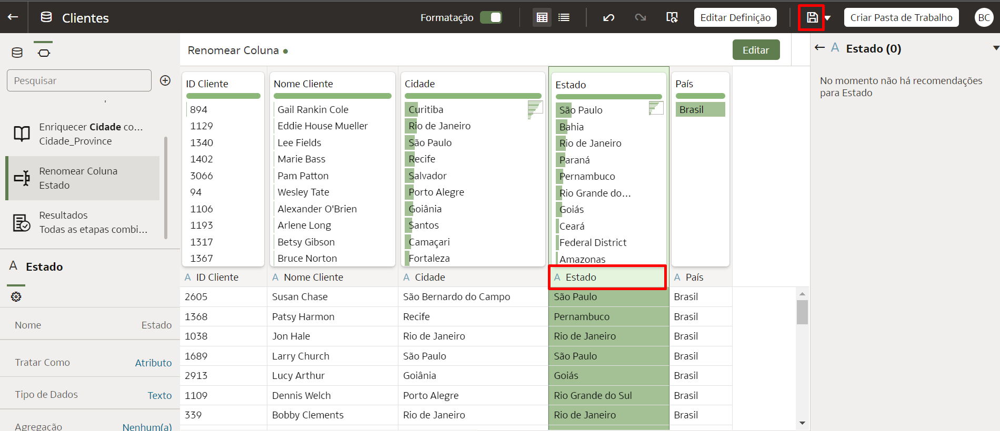

6. Selecione mais uma vez a coluna **Cidade** e agora clique nas recomendações **Enriquecer Cidade com Lat e Long**. Renomeie-as para **Latitude e Longitude**.

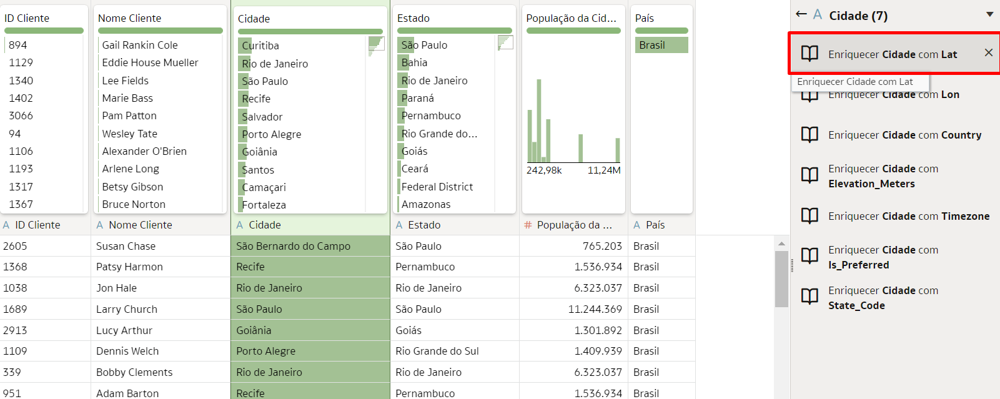

7. Clique no três pontos nas novas colunas (Latitude e Longitude) e selecione **Detalhes do Local...** 


8. Escolha o **Tipo do Local** adequado e clique em **OK**


9. Valide que as novas colunas estão identificadas como localizações.


10. Selecione mais uma vez a coluna **Cidade** e agora clique na recomendação **Enriquecer Cidade com Population**.

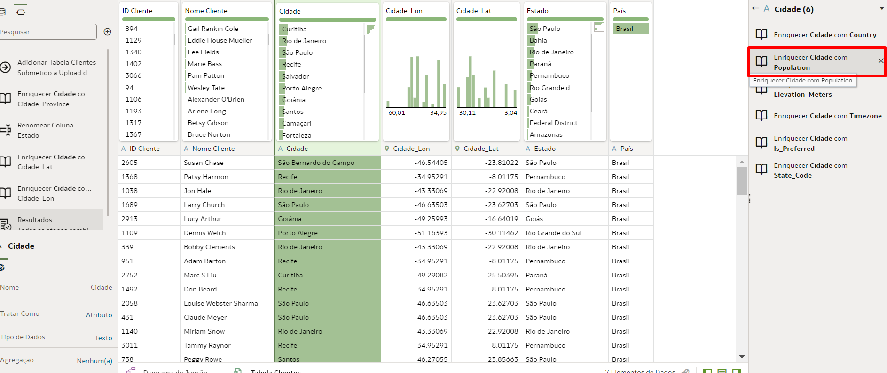

11. Valide que a coluna **População da Cidade** foi criada. Se isso aconteceu corretamente, a segunda tarefa foi concluída com sucesso.

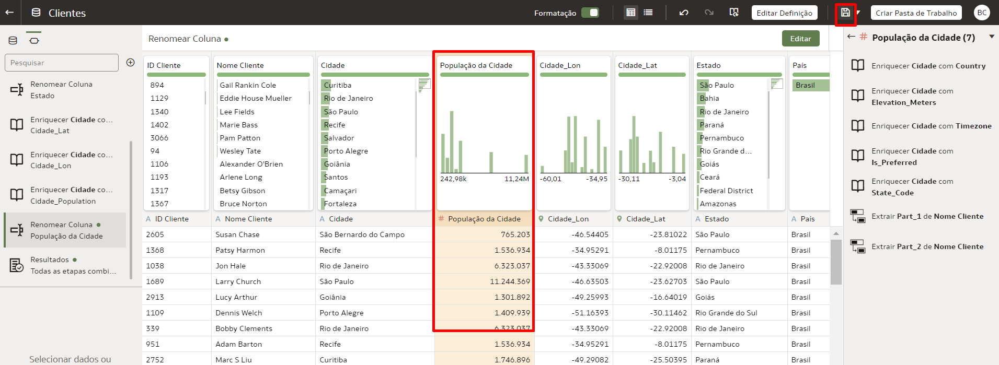

## Task 3: Realizando alterações nas colunas

Agora realizaremos mais algumas adequações que simplificarão a maneira como vamos interagir com os dados na criação da nossa dashboard.

1. Na aba **Dados**, clique no botão para editar os dados da conexão com o banco.

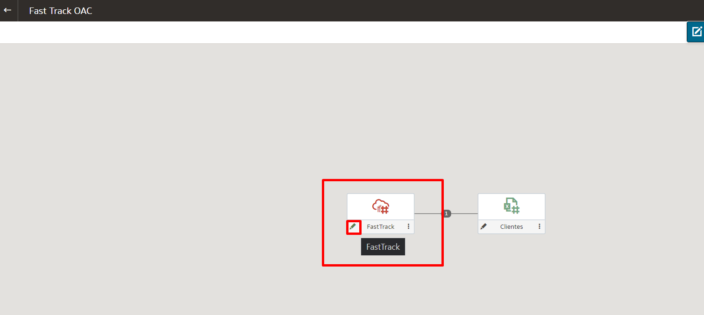

2. Navegue até **PEDIDOS** na aba inferior. No campo MODO DE ENVIO podemos notar que está faltando um acento nas modalidade 'Voo Regular' e 'Voo Expresso'. Vamos atualizar esses valores. Clique nos três pontos, e logo depois em **Substituir...**

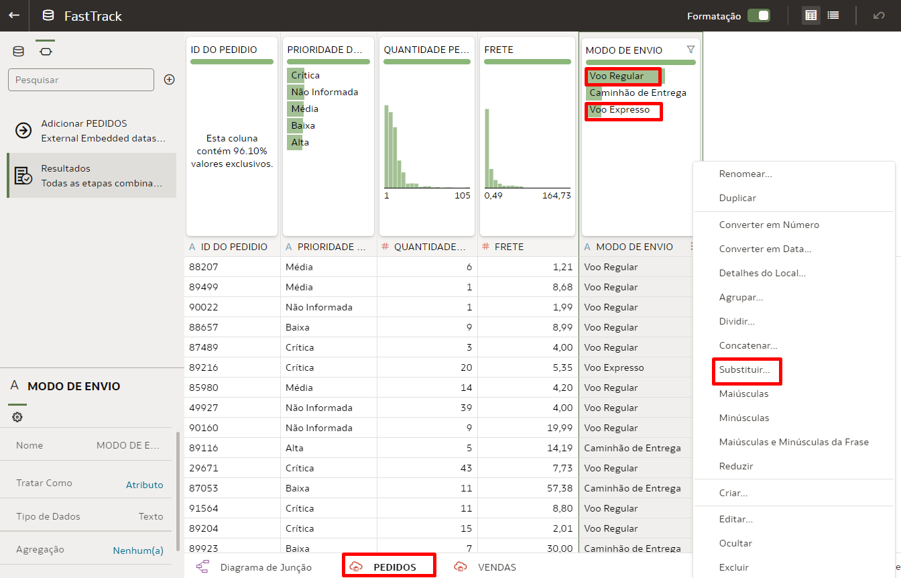

3. Preencha os formulários String para substituir com o valor **Voo** e Nova string com o valor **Vôo**. Isso incluirá o acento nos casos em que o valor Voo apareceu. Clique em **Adicionar Etapa** para que esse passo da transformação seja de fato realizado.


4. Salve para propagar essa mudança para todo o conjunto de dados.

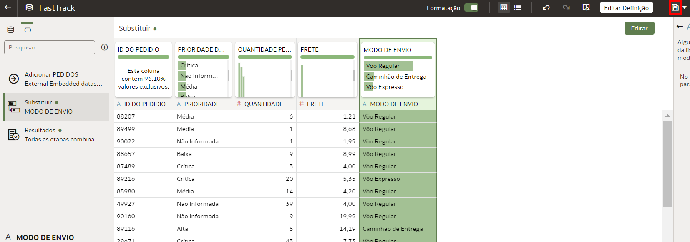

5. Agora realizaremos um agrupamento utilizando a interface do Analytics. Mude a aba inferior para a tabela de **VENDAS**, selecione a coluna **EMBALAGEM DO PRODUTO**, clique nos três pontos e escolha a opção **Agrupar**.


6. Crie duas categorias: 
  - Embalagens Grandes: terá dentro de si os valores Caixa Grande, Caixa Jumbo e Valor Jumbo;
  - Embalagens Pequenas: terá dentro de si os valores Caixa Média, Caixa Pequena, Pacote Pequeno e Saco de Embrulho.
  Após criados os grupos, certifique-se que você deu o nome **Tipos de Embalagem** para a nova coluna que será criada e clique em **Adicionar Etapa**.
  
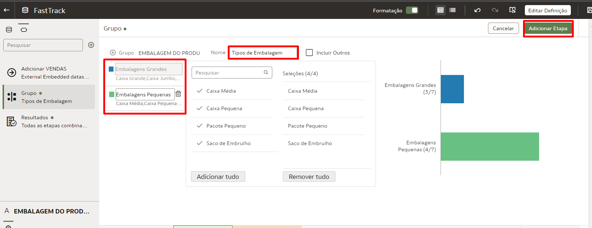

7. Para a próxima alteração criaremos um campo que será originado a partir de uma regra escrita na camada de preparação do OAC. Ainda na aba VENDAS, selecione a coluna LUCRO, clique nos três pontos e selecione **Criar**. Isso fará com que criemos uma nova coluna a partir da coluna Lucro.

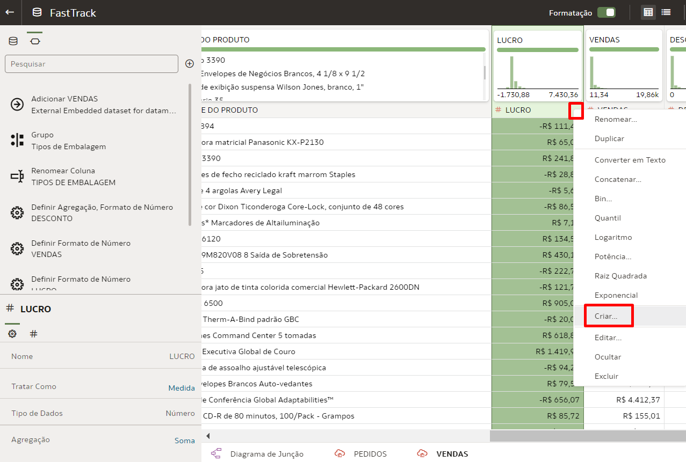

8. Nomeie a nova coluna como **Lucro/Prejuízo** e escreva o código abaixo:
```
CASE WHEN LUCRO >= 0 THEN 'Lucro' ELSE 'Prejuízo' END
```
Não se esqueça de mapear a coluna Lucro (apenas o texto não irá se referenciar a ela).
Clique em **Adicionar Etapa** para salvar esse passo.

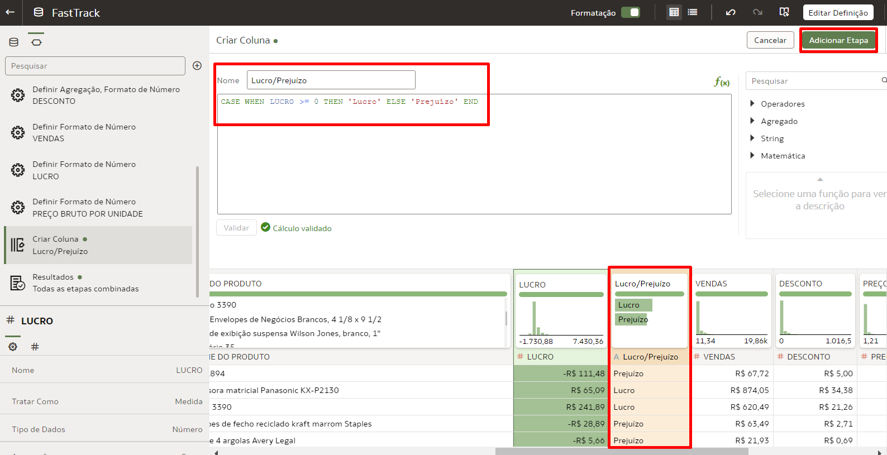

Nossas colunas já estão com a classificação correta (Atributo/Métrica), mas as métricas podem ter diferentes formas de agregação (Soma, Média, Contagem...). Também é possível criar uma formatação para indicar que uma coluna é um valor de moeda em reais (R$), por exemplo. 

9. Seleciona a coluna **VENDAS**, clique na área inferior esquerda no **#** e dentro do Formato do Número, selecione **Moeda**.

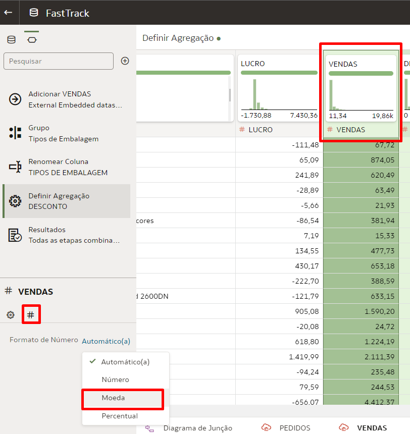

10. Escolha a opção que representa o real **(BRL/R$)**.

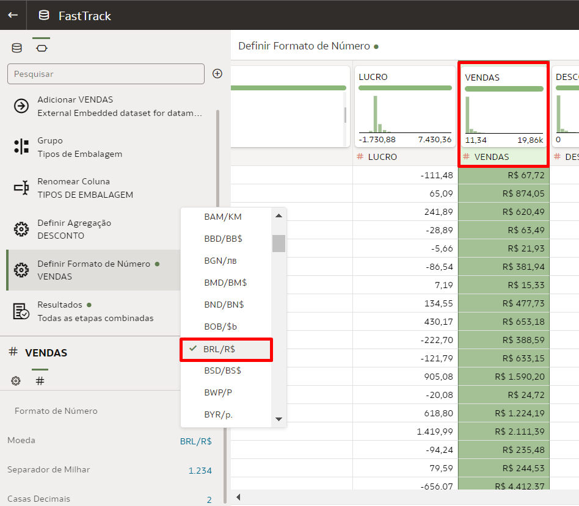

11. Realize o mesmo processo para as colunas **LUCRO**, **DESCONTO** e **PREÇO BRUTO**.


12. Selecione a coluna DESCONTO e desça até a **Agregação**. Selecione **Média**.  Agora a agregação dessa coluna foi alterada.

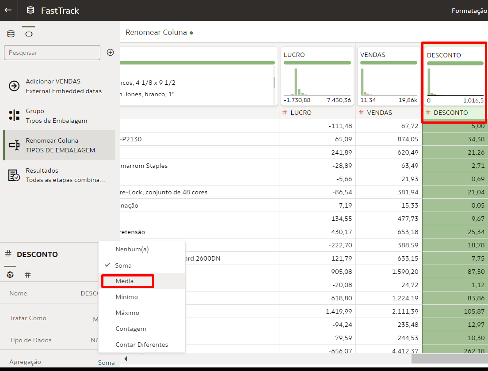

13. Salve mais uma vez o projeto para não perder seu progresso.


## Task 4: Criação de Campos Calculados

O Oracle Analytics também permite a criação de campos calculados dentro do próprio projeto de visualização para trazer informações complementares àquelas já presentes.

1. Navegue para a aba de **Dados** e cliquem com o botão direito em **Meus Cálculos**. Crie um Cálculo com o nome **Quantidade de Pedidos** e inclua o código **COUNT(ID LINHA DO PEDIDO)**.
   Clique em **Validar** e logo após em **Salvar**.

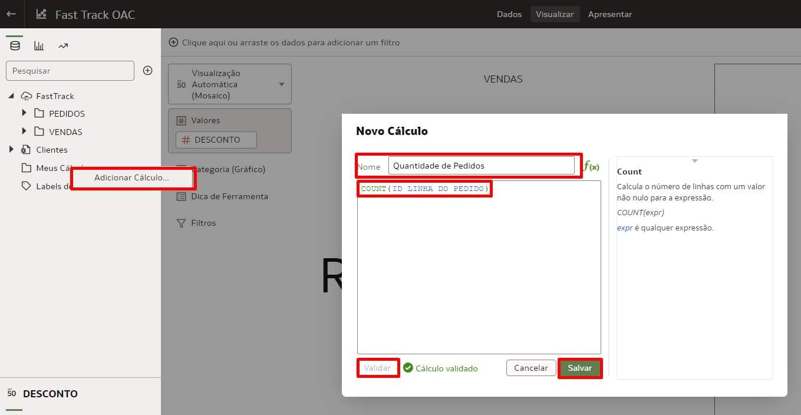

2. Esse campo poderá ser usado posteriormente para a contagem de quantos pedidos existem na nossa base. A visualização abaixo mostra o uso de dois campos criados nessa atividade para trazer um insight: No centro do Donut vemos o valor total de pedidos (~9000), dos quais 52.67% trouxeram Lucro e 47.33% trouxeram prejuízo para a companhia. Trabalharemos em como criar essas visualizações no próximo laboratório.


3. Clique com o botão direito mais uma vez em **Meus Cálculos** e crie um novo cálculo com o nome **LUCRO MÉDIO**. Nele, coloque o **Lucro**, uma **barra de divisão** e traga o campo calculada **Quantidade de Pedidos**.


4. Ao arrastar a quantidade, o sistema trará o código que origina aquele campo calculado. O resultado final deverá ficar assim: **LUCRO / COUNT(ID LINHA DO PEDIDO)**. Valide o cálculo e **salve-o**.


5. Ao arrastar esse valor para a tela, será trazido o lucro médio calculado conforme nossa regra definiu.

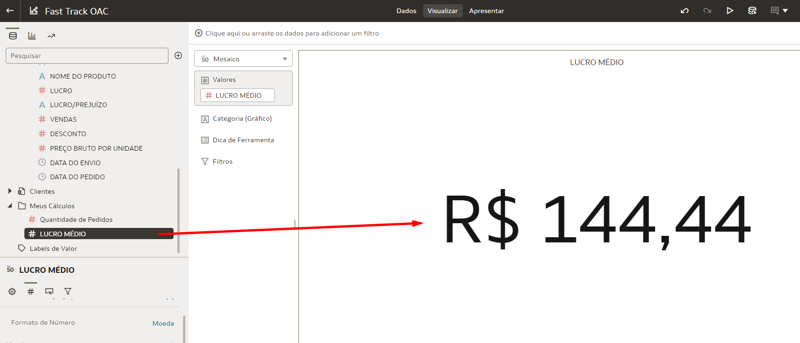

Parabéns, você concluiu o laboratório!

## Conclusão

Nesta sessão você aprendeu a preparar um Conjunto de Dados no Oracle Analytics Cloud, realizando uma série de transformações nos dados e complementando-os com informações externas disponíveis em um arquivo excel.
 
## Autoria

- **Autores** - Thais Henrique, Isabela Alvarez, Breno Comin, Isabelle Dias e Guilherme Galhardo
- **Último Update Por/Date** - Breno Comin, Nov/2022